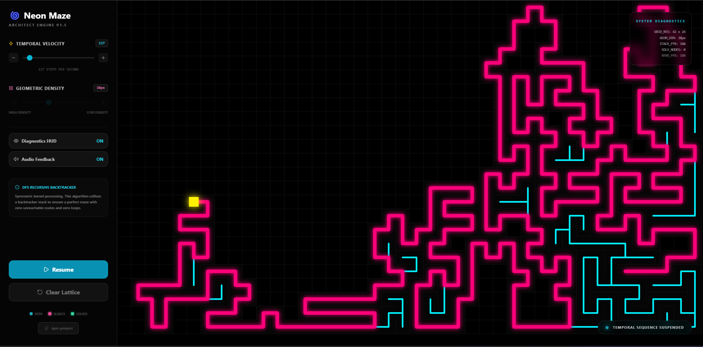

# Neon Maze Architect 🌀

**Interactive Recursive Backtracker maze visualizer** — watch a Depth‑First Search (DFS) carve a perfect maze in real time with neon/cyberpunk visuals.

<p align="center">
  
</p>

<p align="center">
  <a href="https://igor-gregori.github.io/neon-maze-architect/" target="_blank">🔗 Live demo: https://igor-gregori.github.io/neon-maze-architect/</a>
</p>

## 🚀 Project Overview

Neon Maze Architect is a web app that visualizes the Recursive Backtracker (DFS) algorithm building a "perfect" maze (no loops, every cell reachable). The visualization shows the algorithm exploring, hitting dead ends, and backtracking while you tweak the visual style and algorithm speed.

## ✨ Features

- High-performance rendering using the HTML5 Canvas API 🔧
- Real-time visualization of the Recursive Backtracker algorithm 🧭
- UI controls for speed and grid density (cell size) 🎛️
- Neon glow effects (shadowBlur + shadowColor) for a cyberpunk aesthetic ✨
- Deterministic, perfect maze (no closed loops) ✅

## 🧠 Algorithm: Recursive Backtracker (Depth-First Search)

1. Initialize a grid of cells; each cell starts with 4 walls (Top, Right, Bottom, Left).
2. Pick a random starting cell, mark it as visited.
3. From the current cell, check unvisited neighbors (Up, Right, Down, Left).
   - If neighbors exist: push current to stack, pick one at random, remove the walls between current and chosen neighbor, set chosen neighbor as current and mark visited.
   - If none exist: pop from stack to backtrack and continue.
4. Finish when the stack is empty — all cells are visited.

> The result is a perfect maze: exactly one path between any two cells.

## 🧩 Data Structures & Implementation Details

- Grid: a 2D array of `Cell` objects (each cell stores its coordinates and wall boolean array `[top, right, bottom, left]`).
- Stack: JavaScript array used with `push()` / `pop()` for backtracking.
- Rendering: `CanvasRenderingContext2D` for fast strokes, color fills, and neon glow via `shadowBlur`/`shadowColor`.

## 🛠️ Implementation Roadmap

Phase 1 — The Grid (Skeleton)

- Create `index.html` with a `<canvas>` element.
- Implement a `Cell` class (`i`, `j`, `walls: [true, true, true, true]`) and a `draw(ctx)` method to render walls.

Phase 2 — The Walker (Brain)

- Implement `checkNeighbors()` to return unvisited neighbors.
- Implement `removeWalls(current, next)` to toggle the wall booleans.
- Create the main loop using `requestAnimationFrame` to step the algorithm and re-draw.

Phase 3 — The Visuals (Cool Factor)

- Color map: different colors for the current "head", the stack (currently traced path), and completed cells.
- UI sliders for speed (FPS) and grid density (cell size).
- Neon glow using `shadowBlur` and `shadowColor` on canvas shapes.

## ✅ Success Criteria

- Maze generation finishes with every cell visited.
- No closed loops (perfect maze property).
- Backtracking is visible to the user as the algorithm retreats and resumes.

## 💻 Getting Started (Run Locally)

Prerequisites: Node.js

1. Install dependencies:

```bash
npm install
```

2. Run development server:

```bash
npm run dev
```

3. Open the app in your browser (usually `http://localhost:5173`).

Build for production:

```bash
npm run build
npm run preview
```

## 🧭 Controls

- **Speed slider** — change the algorithm's frames per second.
- **Grid density / cell size** — increase cells per row/column to make the maze denser.
- **Reset / Start** — restart generation with new random seed.

(Controls are implemented in `components/ControlPanel.tsx`.)

## 🧑‍💻 Project Structure (high level)

- `index.html` — page with `<canvas>`
- `index.tsx`, `App.tsx` — React app shell
- `components/ControlPanel.tsx` — UI controls
- `services/mazeService.ts` — maze generation logic
- `types.ts`, `constants.ts` — definitions and defaults

## Contributing

Contributions, issues, and feature requests are welcome. Please open a PR or an issue describing what you'd like to change.

## License

This project is open source — include your preferred license here.

---

> If you'd like, I can also add a short GIF screenshot, badges, or a live demo link. 💡
